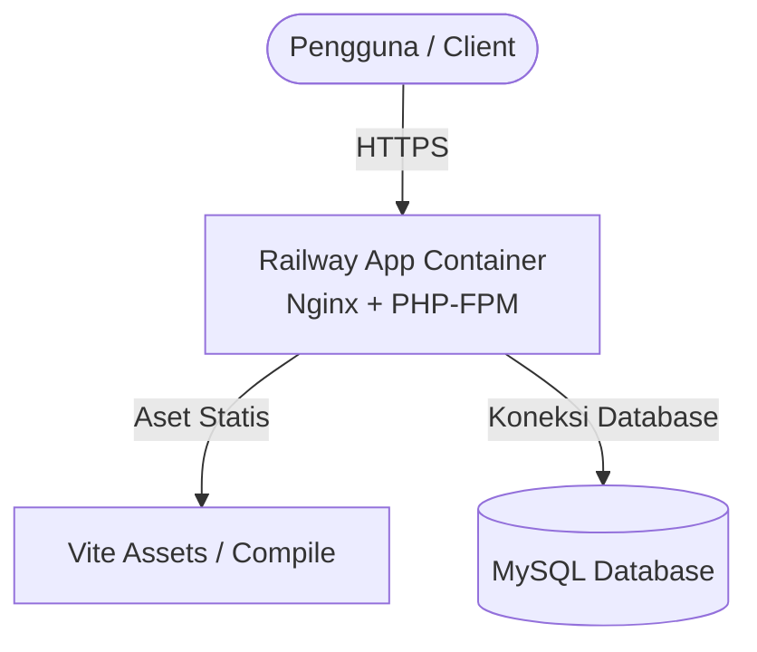

# Panduan & Dokumentasi Deployment: Railway + MySQL

Dokumen ini menjelaskan arsitektur, cara kerja, dan konfigurasi lengkap proses deployment aplikasi **CineManage** ke **Railway** (Platform-as-a-Service berbasis Container) dengan menggunakan **MySQL** (baik layanan internal Railway maupun external cloud database seperti Aiven).

---

## 1. Arsitektur Produksi: Mengapa Railway?

Saat dijalankan di lingkungan produksi cloud, kita menggunakan platform **Railway** yang mendukung pembuatan container secara otomatis via **Nixpacks**:



### Karakteristik Deployment di Railway
* **Nixpacks Engine**: Railway mendeteksi file `composer.json` dan `package.json`/`vite.config.js` di dalam repositori secara otomatis untuk membangun (build) container PHP 8.3 & Node.js, mengompilasi aset front-end, dan menjalankan Nginx bersama PHP-FPM dengan konfigurasi document root mengarah ke `/app/public`.
* **Zero Downtime dengan Pre-deploy**: Railway memungkinkan kita menjalankan perintah migrasi database sebelum container baru melayani lalu lintas pengguna (traffic). Jika migrasi gagal, deployment baru tidak akan dipublikasikan, menjaga aplikasi produksi tetap aman dari error.
* **Trust Proxies**: Aplikasi dikonfigurasi di `bootstrap/app.php` dengan `$middleware->trustProxies(at: '*')` sehingga Railway Load Balancer dapat meneruskan request HTTPS dengan benar, menghindari masalah aset CSS/JS tidak termuat (Mixed Content).

---

## 2. Pilihan Database di Lingkungan Produksi

Anda memiliki dua opsi utama untuk database MySQL di Railway:

### Opsi A: Menggunakan Database MySQL Bawaan Railway (Sangat Direkomendasikan)
Anda dapat membuat database MySQL langsung di dalam proyek Railway yang sama agar terhubung secara lokal/internal dengan performa tinggi.

Setelah menambahkan layanan MySQL di Railway, Railway akan men-generate environment variables berikut:
* `MYSQLHOST` (Host database)
* `MYSQLPORT` (Port database, biasanya 3306)
* `MYSQLDATABASE` (Nama database)
* `MYSQLUSER` (Username database)
* `MYSQLPASSWORD` (Password database)

Karena Laravel mencari variabel dengan format `DB_HOST`, `DB_PORT`, dll., Anda perlu memetakan (map) variabel tersebut pada pengaturan Environment Variables layanan aplikasi Anda di Railway menggunakan sintaks referensi Railway:
```env
DB_CONNECTION=mysql
DB_HOST=${{MYSQLHOST}}
DB_PORT=${{MYSQLPORT}}
DB_DATABASE=${{MYSQLDATABASE}}
DB_USERNAME=${{MYSQLUSER}}
DB_PASSWORD=${{MYSQLPASSWORD}}
```

### Opsi B: Tetap Menggunakan Aiven MySQL (Eksternal via SSL)
Jika Anda ingin tetap menggunakan database **Aiven MySQL** yang sudah dibuat sebelumnya, gunakan kredensial dari Aiven dan pastikan menambahkan variabel berikut di Railway agar koneksi database terenkripsi secara aman (SSL/TLS):
```env
MYSQL_ATTR_SSL_CA=/etc/ssl/certs/ca-certificates.crt
```
Variabel ini menginstruksikan driver PDO MySQL di Railway untuk memverifikasi sertifikat SSL Aiven menggunakan sertifikat root terpercaya sistem Linux bawaan.

---

## 3. Langkah-Langkah Deployment via Dashboard Railway

Ikuti langkah-langkah berikut untuk men-deploy aplikasi Anda:

### Langkah 1: Hubungkan Repositori Git
1. Buka [Railway Dashboard](https://railway.app) dan login dengan akun Anda.
2. Klik **New Project** > **Deploy from GitHub repo**.
3. Pilih repositori proyek **crud_uas_241011750041**.

### Langkah 2: Tambahkan Database MySQL (Jika menggunakan Opsi A)
1. Di dalam kanvas proyek Railway Anda, klik **+ New** > **Database** > **Add MySQL**.
2. Tunggu hingga layanan MySQL selesai dibuat.

### Langkah 3: Konfigurasi Environment Variables Aplikasi
Klik pada layanan aplikasi Laravel Anda di Railway, lalu masuk ke tab **Variables** dan tambahkan variabel berikut:
* `APP_NAME` = `CineManage`
* `APP_ENV` = `production`
* `APP_KEY` = *(Gunakan nilai dari file `.env` lokal Anda, contoh: `base64:4aehes...`)*
* `APP_DEBUG` = `false`
* `APP_URL` = `${{RAILWAY_PUBLIC_DOMAIN}}` *(Referensi otomatis ke domain publik Railway)*
* `DB_CONNECTION` = `mysql`

**Jika menggunakan Database Railway (Opsi A):**
* `DB_HOST` = `${{MYSQLHOST}}`
* `DB_PORT` = `${{MYSQLPORT}}`
* `DB_DATABASE` = `${{MYSQLDATABASE}}`
* `DB_USERNAME` = `${{MYSQLUSER}}`
* `DB_PASSWORD` = `${{MYSQLPASSWORD}}`

**Jika menggunakan Database Aiven MySQL (Opsi B):**
* `DB_HOST` = *(Host Aiven)*
* `DB_PORT` = *(Port Aiven)*
* `DB_DATABASE` = `defaultdb`
* `DB_USERNAME` = `avnadmin`
* `DB_PASSWORD` = *(Password Aiven)*
* `MYSQL_ATTR_SSL_CA` = `/etc/ssl/certs/ca-certificates.crt`

### Langkah 4: Atur Pre-deploy Command & Domain
1. Pada layanan aplikasi Anda di Railway, masuk ke tab **Settings**.
2. Cari bagian **Deploy** -> **Pre-deploy Command**, lalu isi dengan:
   ```bash
   php artisan migrate --force
   ```
   *Perintah ini akan secara otomatis dijalankan setiap kali ada update kode sebelum versi baru aktif.*
3. Cari bagian **Networking** -> **Generate Domain** untuk mendapatkan URL publik aplikasi Anda.

---

## 4. Menjalankan Database Seeding Awal (Satu Kali)

Karena database produksi Anda masih kosong setelah migrasi pertama kali dijalankan, Anda perlu memasukkan data film awal dan akun administrator.

Ada dua cara untuk menjalankan seeder di Railway:

### Metode 1: Menggunakan Shell di Dashboard Railway (Mudah)
1. Klik layanan aplikasi Anda di Railway.
2. Masuk ke tab **Shell** / **Terminal**.
3. Jalankan perintah berikut:
   ```bash
   php artisan db:seed --force
   ```

### Metode 2: Menggunakan Railway CLI
Jika Anda menginstal Railway CLI di komputer lokal, jalankan perintah berikut dari terminal proyek Anda:
```powershell
railway run php artisan db:seed --force
```

---

## 5. Karakteristik File Upload di Railway

Sama seperti Vercel, container aplikasi di Railway bersifat **ephemeral** (sementara). File poster film baru yang diunggah ke folder `storage/app/public` secara lokal di dalam container akan hilang setiap kali aplikasi di-deploy ulang atau dimulai ulang (cold start).

### Solusi untuk Projek UAS:
* **Gunakan URL Gambar Eksternal**: Saat menambahkan data film melalui panel Admin, disarankan untuk mengisi input poster film menggunakan link/URL gambar langsung dari internet (seperti dari IMDb, Unsplash, atau CDN eksternal) agar gambar tetap tampil secara permanen.
* **Storage Eksternal (Produksi Komersial)**: Untuk aplikasi tingkat lanjut, hubungkan Laravel filesystem ke cloud storage seperti **Cloudinary**, **AWS S3**, atau **SupaBase Storage** agar file tersimpan secara permanen di server khusus media.
