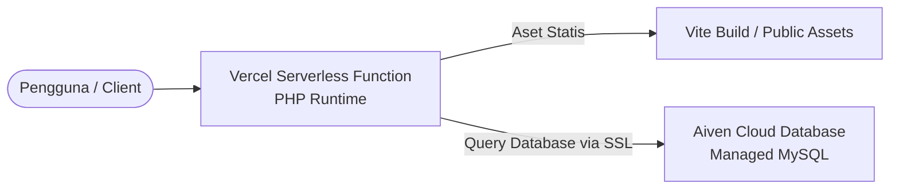

# Panduan & Dokumentasi Deployment: Vercel + Aiven MySQL
Dokumen ini menjelaskan arsitektur, cara kerja, dan konfigurasi lengkap proses deployment aplikasi **CineManage** ke **Vercel** (Serverless Web Hosting) dan **Aiven** (Cloud Database).

---

## 1. Arsitektur Produksi: Mengapa Vercel & Aiven?

Saat dijalankan secara lokal di komputer (development), aplikasi menggunakan:
* **Web Server**: Apache/Nginx bawaan PHP (`php artisan serve`).
* **Database**: MySQL lokal (`localhost` / `127.0.0.1`) lewat XAMPP/Laragon.

Namun, di lingkungan produksi (production cloud), kita menggunakan kombinasi **Vercel** dan **Aiven**:



### Karakteristik Vercel (Stateless & Ephemeral)
Vercel adalah platform *Serverless* yang bersifat *stateless* (tidak menyimpan status) dan *ephemeral* (sementara). 
* **Keuntungan**: Sangat cepat, gratis, otomatis melakukan build frontend (Vite), dan memiliki performa tinggi.
* **Tantangan**: Sistem file Vercel bersifat *read-only* (hanya bisa dibaca). Anda tidak bisa menginstal database MySQL lokal di dalam server Vercel, dan file yang diunggah secara lokal ke server akan hilang saat serverless function melakukan *cold-start* (di-restart otomatis oleh Vercel).

### Peran Aiven (Persistent Storage)
Karena Vercel tidak bisa menyimpan data secara permanen, kita memerlukan **Aiven** sebagai penyedia layanan database MySQL berbasis Cloud (Managed Service).
* Database berada di server cloud Aiven (misalnya berlokasi di AWS Singapura) yang selalu aktif dan terus menyimpan data Anda secara aman.
* Vercel akan mengirimkan kueri database (insert, select, update, delete) secara remote ke Aiven melalui jaringan internet yang aman.

---

## 2. Detail Konfigurasi Vercel

Beberapa konfigurasi khusus telah diterapkan agar Laravel dapat berjalan dengan lancar di lingkungan serverless Vercel:

### A. File `vercel.json`
File ini mengontrol bagaimana Vercel memproses aplikasi Laravel Anda:
* **`functions`**: Menentukan bahwa file `api/index.php` akan dieksekusi menggunakan runtime PHP (`vercel-php@0.7.4`).
* **`routes`**: 
  * Mengarahkan aset statis CSS & JS hasil kompilasi Vite (`/build/(.*)`) langsung ke direktori `/public/build/` agar dimuat dengan cepat.
  * Meredireksi semua request URL lainnya (`/(.*)`) ke `api/index.php` yang bertindak sebagai jembatan/proxy ke Laravel.
* **`env`**: Menyimpan konfigurasi cache Laravel ke folder `/tmp` (satu-satunya direktori di Vercel yang memiliki izin menulis/writeable).

### B. File `api/index.php`
Berperan sebagai *entry point* (gerbang masuk) untuk Vercel. File ini hanya memuat kode:
```php
<?php
require __DIR__ . '/../public/index.php';
```
Ini berguna untuk menjembatani struktur folder serverless Vercel dengan struktur folder standard Laravel public index.

### C. Proxy & SSL (`bootstrap/app.php`)
Di dalam `bootstrap/app.php`, terdapat baris:
```php
$middleware->trustProxies(at: '*');
```
Vercel menggunakan reverse proxy untuk menyajikan aplikasi Anda. Tanpa konfigurasi *Trust Proxies* ini, Laravel tidak tahu bahwa aplikasi berjalan di atas HTTPS, sehingga semua aset (CSS, JS, Gambar) akan dimuat secara tidak aman menggunakan protokol HTTP (`http://`) dan menyebabkan error *Mixed Content*.

---

## 3. Detail Konfigurasi Aiven MySQL

Aiven menerapkan standar keamanan tinggi dengan mewajibkan koneksi terenkripsi (SSL/TLS). 

### Parameter Koneksi dari Aiven:
1. **Host**: Alamat URL unik server database Anda (contoh: `crud-db-...aivencloud.com`).
2. **Port**: Port kustom dari Aiven (biasanya berupa angka acak seperti `15625`, bukan port MySQL standar `3306`).
3. **Database Name**: `defaultdb` (database bawaan yang dibuat oleh Aiven).
4. **User**: `avnadmin` (administrator utama).
5. **Password**: Kunci keamanan unik yang di-generate oleh Aiven.
6. **SSL Mode**: `REQUIRED` (Artinya database menolak semua koneksi yang tidak terenkripsi).

Agar Laravel dapat terhubung ke database yang mewajibkan SSL ini, kita menambahkan parameter berikut pada Environment Variable di Vercel:
```env
MYSQL_ATTR_SSL_CA=/etc/ssl/certs/ca-certificates.crt
```
Variabel ini memberi tahu driver PDO MySQL di server Vercel untuk memverifikasi sertifikat SSL menggunakan daftar sertifikat root tepercaya milik sistem Linux Vercel.

---

## 4. Langkah-Langkah Sinkronisasi & Migrasi (Lokal ke Cloud)

Agar database cloud Aiven memiliki struktur tabel (films, users) yang sama dengan database lokal Anda, lakukan langkah-langkah berikut:

### Langkah A: Konfigurasi `.env` Lokal Sementara
Ubah isi file `.env` di komputer lokal Anda menggunakan kredensial database cloud Aiven:
```env
DB_CONNECTION=mysql
DB_HOST=crud-db-241011750041-crud-uas-241011750041.l.aivencloud.com
DB_PORT=15625
DB_DATABASE=defaultdb
DB_USERNAME=avnadmin
DB_PASSWORD=GANTI_DENGAN_PASSWORD_DARI_AIVEN
```

### Langkah B: Jalankan Perintah Migrasi & Seeding
Buka terminal di VS Code, lalu jalankan perintah:
```powershell
php artisan migrate --seed
```
*Perintah ini akan terhubung ke cloud Aiven, membuat tabel-tabel database, dan memasukkan data film awal beserta user admin.*

### Langkah C: Kembalikan `.env` Lokal ke Semula
Setelah proses migrasi sukses, kembalikan konfigurasi database di file `.env` lokal Anda ke database lokal (`127.0.0.1`) agar Anda dapat melakukan pengujian lokal kembali tanpa mempengaruhi data cloud:
```env
DB_CONNECTION=mysql
DB_HOST=127.0.0.1
DB_PORT=3306
DB_DATABASE=db_uas_241011750041
DB_USERNAME=root
DB_PASSWORD=
```

---

## 5. Keterbatasan & Solusi File Upload di Vercel

Karena Vercel bersifat *stateless*, setiap kali Anda mengunggah gambar poster film baru melalui web yang di-deploy di Vercel:
1. Gambar akan tersimpan sementara di disk Vercel.
2. Ketika serverless function mengalami *restart* otomatis (biasanya setelah beberapa menit tidak ada aktivitas, atau saat deploy ulang), file gambar tersebut akan **hilang**.

### Solusi untuk Demo Projek UAS:
* **Gunakan Link Gambar Eksternal**: Saat menambahkan data film baru di halaman admin, daripada mengunggah file gambar dari komputer, Anda dapat memodifikasi seeder database agar menggunakan URL gambar langsung dari internet (misalnya dari CDN atau situs web film seperti IMDb/Unsplash) yang tidak akan terpengaruh oleh restart server.
* **Layanan Cloud Storage (Opsional)**: Untuk aplikasi tingkat produksi sesungguhnya, file upload biasanya dihubungkan ke penyedia pihak ketiga seperti AWS S3, Google Cloud Storage, Cloudinary, atau Imgur API, sehingga file tersimpan secara permanen di cloud khusus file.
